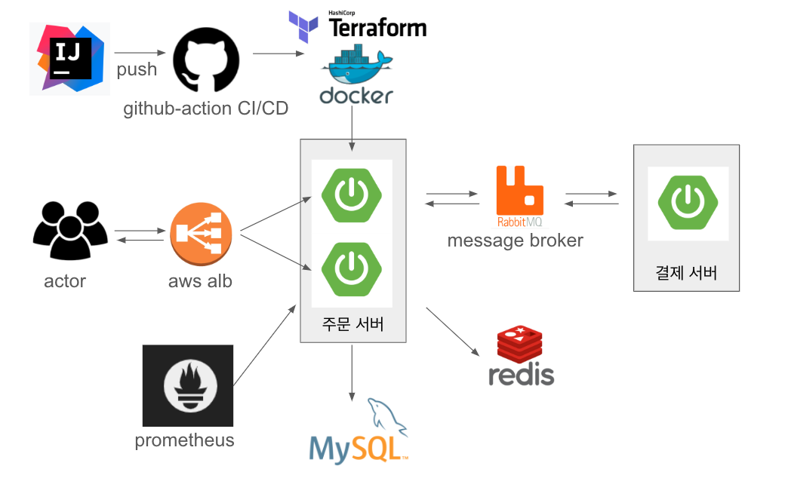

# 프로젝트 개요

동시에 대규모 예매 트래픽이 발생하는 상황을 가정하여 데이터가 안정적이게 처리될 수 있도록 하는 시스템을 구축하는 것이 목표입니다.
API를 여러 개 만드는 대신, 백엔드 로직의 안정성과 효율성에 중점을 두어 구현하였습니다.

## 기술 스택

- **언어**: Java 17
- **프레임워크**: Spring Boot
- **데이터베이스**: MySQL, Redis
- **메시지 큐**: RabbitMQ
- **데브옵**: Github-Actions, Docker, AWS EC2, AWS ALB
- **모니터링**: Prometheus, Grafana
- **테스트**: JUnit5, Mockito

## 전체 프로젝트 구조

## 프로젝트 WIKI 
[프로젝트 WIKI](https://github.com/f-lab-edu/safe-ticket/wiki)
